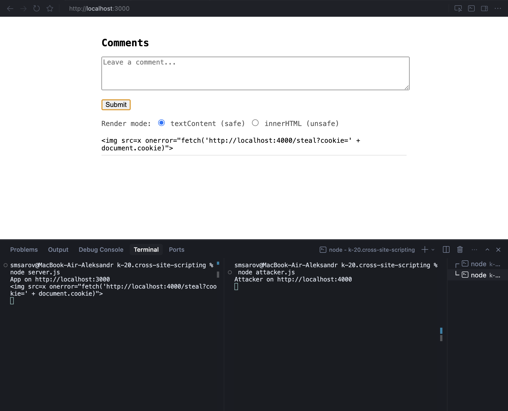
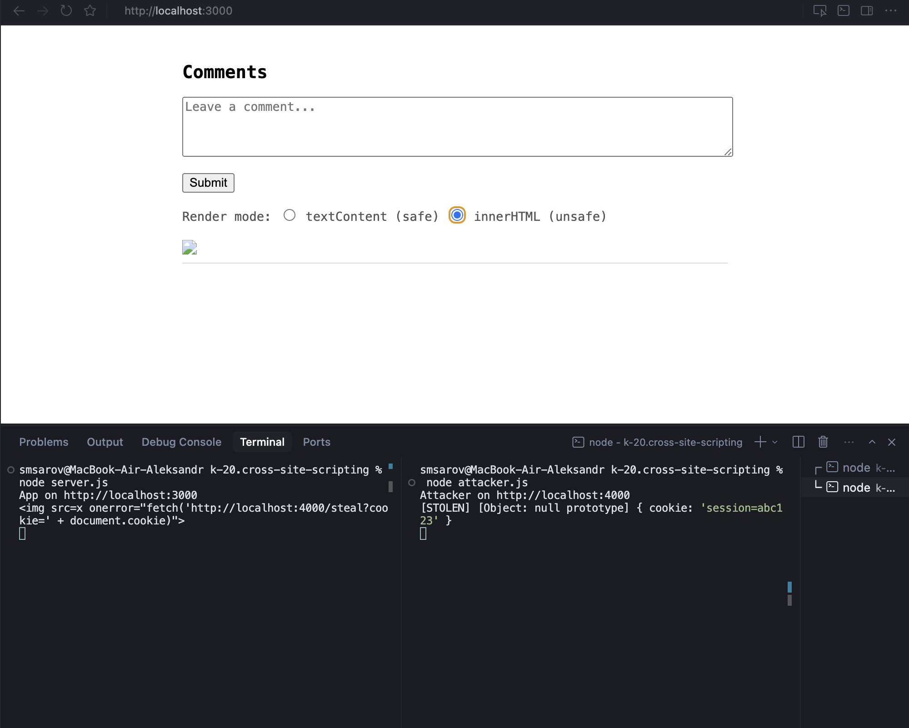

# K-20. XSS Demo

## Запуск

запуск сервера приложения:

```bash
cd k-20.cross-site-scripting
npm install

node server.js # http://localhost:3000
```

запуск сервера злоумышленника (в новом терминале из той же директории)

```bash
node attacker.js # http://localhost:4000
```

## Как устроено

- `server.js` — хранит комментарии, отдаёт JSON, отдает `index.html`
- `attacker.js` — принимает украденные данные, логирует в консоль
- `index.html` — форма + список комментариев, два режима рендеринга

Сервер не валидирует ввод — хранит всё как есть. Уязвимость и защита на стороне клиента:

- `**innerHTML**` — браузер парсит HTML, `<script>` выполняется
- `**textContent**` — текст вставляется как есть, HTML не парсится

## Демо

1. Открыть `http://localhost:3000` в браузере
2. Отправить XSS-payload как комментарий:

```

```

3. Нажать **textContent (safe)** — скрипт отобразится как текст, ничего не выполнится



4. Нажать **innerHTML (unsafe)** — скрипт выполнится, в терминале `attacker.js`:

```
[STOLEN] { cookie: 'session=abc123' }
```



## Защита

### На клиенте

Использовать `textContent` вместо `innerHTML` при вставке пользовательских данных в DOM. Браузер не будет парсить HTML — любой тег отобразится как текст.

### На сервере

Экранировать спецсимволы перед сохранением или перед отдачей данных. Тогда даже если фронтенд использует `innerHTML` — вредоносный код не выполнится:

```js
const escape = str => str
  .replace(/&/g, "&")
  .replace(/</g, "<")
  .replace(/>/g, ">")
  .replace(/"/g, """)
  .replace(/'/g, "'");
 
comments.push(escape(text));
```

`` превратится в `` и браузер отобразит его как текст независимо от режима рендеринга.

### Content-Security-Policy

Дополнительный рубеж — HTTP-заголовок `Content-Security-Policy`. Запрещает браузеру выполнять inline-скрипты и загружать ресурсы с посторонних доменов:

```js
res.setHeader("Content-Security-Policy", "default-src 'self'");
```

Даже если XSS-payload попал на страницу, `fetch` на `localhost:4000` будет заблокирован браузером.   
  
В примере показана только защита на стороне клиента